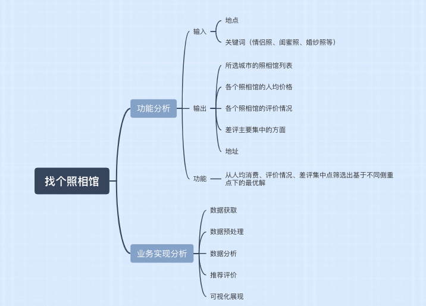

项目的远大理想是帮助每一个选择困难症做选择，出发点是最近和姐妹商量去拍姐妹写真，然而纠结了一个多星期的我们三还没有确定去哪个工作室...
目前，该项目在持续开发完善中...

##主要功能包括：
### 一.数据获取
1. 美团搜索数据爬取（获取相关店铺、人均价格、位置、评价数、差评信息） √已完成
2. 小红书店铺搜索信息爬取（查看是否有排雷贴，如果有可以获取到差评信息） 正在进行中
### 二.数据分析
1. 人均单价的箱线图和散点图
2. 店铺评分散点图
3. 差评信息的语义分析以及词云图绘制
### 三. 帮我选择
1. 帮我计算每个店铺的综合评分，以及店铺最吸引人的关键词（如价格低，评价好，销量高，评价多等

...
